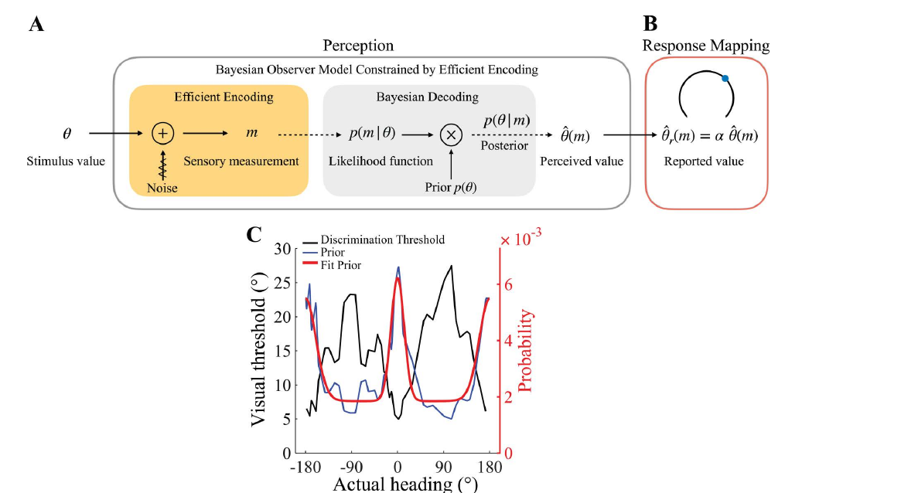
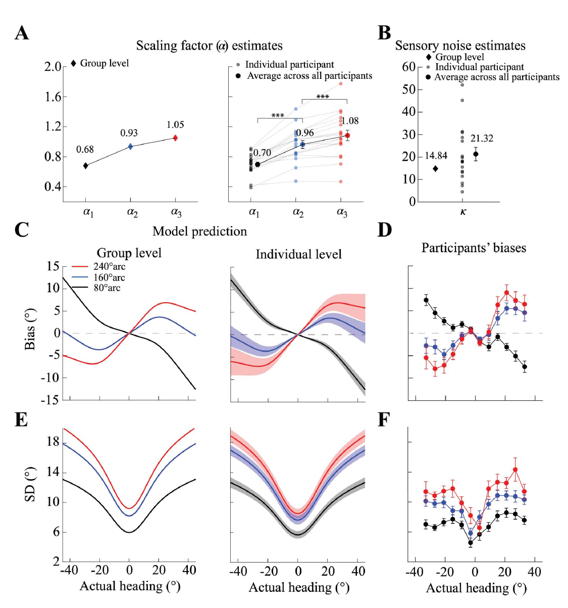
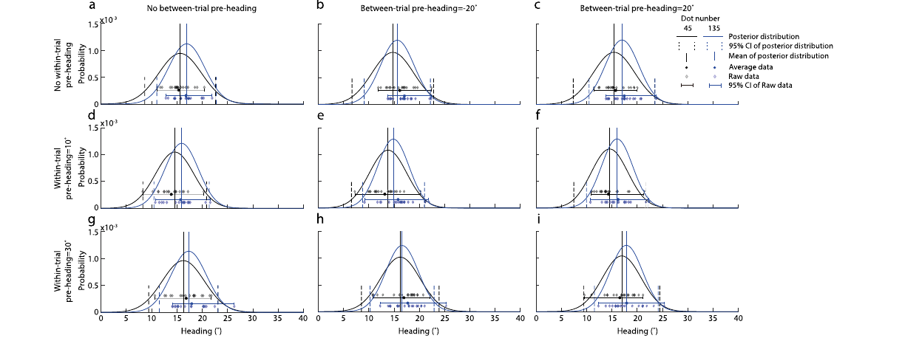
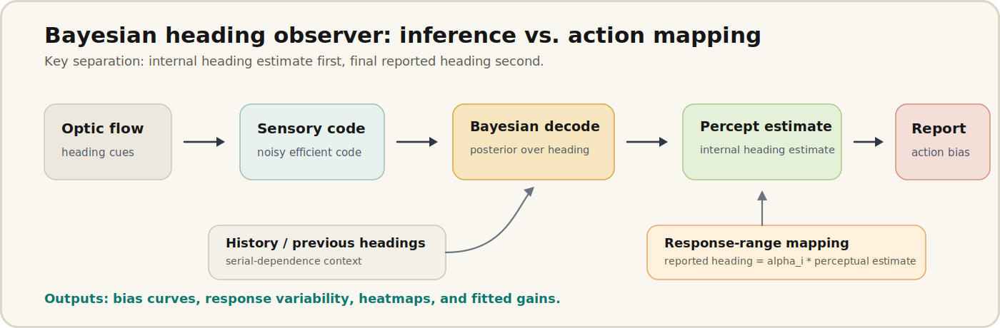

# Bayesian Heading Observer

Code companion for Bayesian observer models of human heading perception from optic flow.

This repository packages a published vision-science modeling line in a readable form: how humans infer self-motion direction from noisy optic-flow input, why heading reports become systematically biased, and how to separate perceptual inference from the final perception-to-action report.

## 30-second overview

- **Question:** When a person navigates from optic flow, which part of the system creates heading bias: sensory uncertainty, Bayesian prior integration, memory from previous headings, or the final action/report stage?
- **Model idea:** Build an efficient Bayesian observer for heading perception, then add a linear perception-action mapping so the internal perceptual estimate and the reported heading are not forced to be identical.
- **VR/XR bridge:** The same decomposition is useful for VR/XR navigation because display, control, and interface systems need to know whether a user's error comes from perception, memory, or action mapping.
- **Contribution:** The 2025 paper shows a response-range-dependent perception-action mapping; the 2022 paper shows attractive serial dependence at perceptual and postperceptual stages.
- **Main outputs:** predicted bias curves, response-variability curves, posterior/response heatmaps, fitted action gains, sensory-noise estimates, and compact reproducible demo plots.
- **Status:** public code companion. The demo uses synthetic data; subject-level participant files are not committed here.

## Key paper figures

The core result is not just curve fitting. The model separates a statistically grounded perceptual estimate from the reported action, then tests whether that separation explains human heading biases.

### Efficient Bayesian observer plus response mapping



*Figure from Sun, Xu, and Stocker (2025), PLOS Computational Biology. The perceptual system first encodes optic-flow heading under uncertainty and decodes a Bayesian estimate. A separate response mapping transforms that internal estimate into a reported heading.*

### Response-range-dependent bias explained by the model



*Figure from Sun, Xu, and Stocker (2025). The fitted action gain changes with response range, and the model predicts both bias and response variability across participants.*

### Serial dependence as a prior/history effect



*Figure from Xu, Sun, Zhang, and Li (2022), Journal of Vision. Previous headings can shift posterior distributions, which helps explain attractive serial dependence in optic-flow heading perception.*

## Pipeline

<p align="center">
  
</p>

The corrected diagram keeps the main distinction explicit:

- optic-flow input is encoded under sensory uncertainty;
- Bayesian decoding produces an internal perceptual estimate;
- previous headings can act as history/context for serial dependence;
- a response-range-dependent linear mapping turns the internal estimate into the reported heading.

## Repository structure

| Path | Purpose |
| --- | --- |
| `src/bayesian_heading_observer/model.py` | Compact Python implementation for the synthetic Bayesian observer demo. |
| `demo/run_demo.py` | One-command entry point that writes model-prediction and heatmap figures. |
| `docs/pipeline.svg` | Corrected public-facing pipeline diagram. |
| `docs/figures/` | Cropped key figures from the published papers, with citations in this README. |
| `matlab/original/` | Original MATLAB research scripts without subject-level data files. |
| `CITATION.cff` | Repository citation metadata. |

## Quickstart

```bash
python3 -m venv .venv
source .venv/bin/activate
python3 -m pip install -r requirements.txt
python3 -m demo.run_demo
```

Expected outputs:

```text
outputs/model_prediction.png
outputs/posterior_heatmap.png
```

The demo is designed for fast inspection of the model mechanics. It does not attempt to reproduce paper figures from participant-level files.

## What the demo shows

The runnable Python demo implements a compact version of the observer logic:

1. Build a center-biased prior over heading.
2. Transform the heading axis through efficient coding.
3. Generate noisy sensory measurements.
4. Infer the posterior over heading.
5. Apply a linear perception-to-action gain.
6. Plot predicted response bias and response distributions.

## Main modules

### Python demo

`src/bayesian_heading_observer/model.py` contains the public synthetic implementation. It is intentionally small so readers can see the modeling chain directly:

- prior construction on a circular heading axis;
- sensory likelihood under noise;
- posterior inference;
- circular mean and variability summaries;
- perception-action gain;
- figure writing for the demo.

### Original MATLAB research scripts

The original MATLAB code is preserved under `matlab/original/`.

Key routines:

- `fun_BayesInference.m`: efficient-coding Bayesian observer inference.
- `main_GroupMLE.m`: group-level maximum-likelihood fit.
- `main_EachSubjFitParam.m`: subject-level parameter fitting.
- `main_FitPrior.m`: prior fitting.
- `plot_HeatMap.m`: response-distribution visualization.

Subject-level `.mat` files are intentionally not included.

## Expected outputs

Depending on the path used, outputs include:

- bias curves comparing actual and reported heading;
- response-variability curves;
- posterior or response-distribution heatmaps;
- fitted perception-action gains;
- fitted sensory-noise parameters;
- MATLAB figures from the original research scripts when run in the original data environment.

Generated artifacts should go under `outputs/` or another ignored local directory.

## Publications

**Co-first author:** Sun, Q.*, **Xu, L.H.***, Stocker, A.A. (2025). A linear perception-action mapping accounts for response range-dependent biases in heading estimation from optic flow. *PLOS Computational Biology*, 21(6), e1013147.
[Paper](https://journals.plos.org/ploscompbiol/article?id=10.1371/journal.pcbi.1013147) | [DOI](https://doi.org/10.1371/journal.pcbi.1013147)

**First author:** Xu, L.H., Sun, Q., Zhang, B., Li, X. (2022). Attractive serial dependence in heading perception from optic flow occurs at the perceptual and postperceptual stages. *Journal of Vision*, 22(12), 11.
[Paper](https://pmc.ncbi.nlm.nih.gov/articles/PMC9652722/) | [DOI](https://doi.org/10.1167/jov.22.12.11)

## Citation

```bibtex
@article{sun_xu_stocker_2025_heading_mapping,
  title = {A linear perception-action mapping accounts for response range-dependent biases in heading estimation from optic flow},
  author = {Sun, Qichao and Xu, Linghao and Stocker, Alan A.},
  journal = {PLOS Computational Biology},
  volume = {21},
  number = {6},
  pages = {e1013147},
  year = {2025},
  doi = {10.1371/journal.pcbi.1013147}
}

@article{xu_2022_serial_dependence_heading,
  title = {Attractive serial dependence in heading perception from optic flow occurs at the perceptual and postperceptual stages},
  author = {Xu, Linghao and Sun, Qichao and Zhang, Biao and Li, Xingshan},
  journal = {Journal of Vision},
  volume = {22},
  number = {12},
  pages = {11},
  year = {2022},
  doi = {10.1167/jov.22.12.11}
}
```

## Data note

This public repository intentionally uses a synthetic demo. The papers describe the experimental data and modeling results; participant-level data should be shared only through the appropriate release channel.
